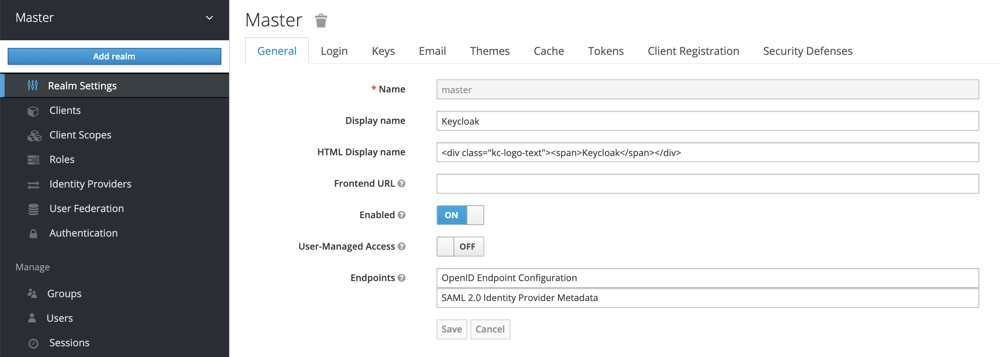

[source,bash,role="execute"]
----
oc process \
  -f https://raw.githubusercontent.com/keycloak/keycloak-containers/master/openshift-examples/keycloak-https.json \
  -p APPLICATION_NAME=keycloak \
  -p KEYCLOAK_USER=admin \
  -p KEYCLOAK_PASSWORD=admin \
  -p NAMESPACE=%username%-tutorial \
  | oc create -n %username%-tutorial -f -

oc set image deploymentconfig/keycloak keycloak=quay.io/keycloak/keycloak:10.0.1
----

Let's decorate the deployment.

[source,bash,role="execute"]
----
oc label dc/keycloak app.openshift.io/runtime=sso --overwrite=true -n %username%-tutorial
----

== Create a security realm

Log in Keycloak, click on the link on the upper-right corner and click on *Administration Console*.

Use admin/admin as credentials.

Hover over the current realm area, upper left corner, as in the picture and click con *Add realm*.

Finally enter the name *customer*, then press *Create*.

== Create a custom client

Click on the *Clients* area on the left, then click on *Create* on clients area.

Next, create a client with the name *istio*. You do not need to add more information and leave the Client Protocol as openid-connect. Click *Save*.

== Create a role

To be able to select user by roles, we need to create at least one role. Create a role called *customer*. If you want, you can create another role just for testing.

== Create a test user

Go to *Users* and click on *Add user*. Give the user just user name: *jason*.

We have to set the password to "*mysecretpassword*" (in *Credentials* tab) and make sure is not temporary.

Now let's assign our user the role we created before. Select the role ad click on *Add selected*. 

image:./images/keycloak-assign-role.png[Assign role]

== Verify the result

If you have set id and password as suggested you should be able to generate an access_token executing the next command:

[source,bash,role="execute"]
----
export TOKEN_JSON=$(curl \
  -sk \
  --data "username=jason&password=mysecretpassword&grant_type=password&client_id=istio" \
  https://secure-keycloak-%username%-tutorial.%cluster_subdomain%/auth/realms/customer/protocol/openid-connect/token \
  | jq -r '.access_token | split(".") | .[1]' | base64 -d)

echo $TOKEN_JSON | jq .
----

We need to fix a couple of things here. The *audience* of the token is *“account”*, but we don't want to just check if audience is account as in may example out there.

[source,bash,role="execute"]
----
echo $TOKEN_JSON | jq .aud
----

The other thing we want to fix is that Istio (at least with the version 1.1.7 or Red Hat Service Mesh 1.0.9) cannot handle nexted attributes... so we have to flatten this structure surfacing roles.

[source,bash,role="execute"]
----
echo $TOKEN_JSON | jq .realm_access.roles
----

== Adjusting the values returned in attribute aud / audience

So let’s add just a value to the audience. To do this, open client *istio* and select the tab *Mappers* and press on the button *Create*. In the next form, we create a mapper that adds a hard coded value to the audience.

WARNING: XYZ suggests that replaceing the complete value of the attribute aud (audience) is not that easy and could bring side effects with it. 

Let's get a new token and check audience.

[source,bash,role="execute"]
----
export TOKEN_JSON=$(curl \
  -sk \
  --data "username=jason&password=mysecretpassword&grant_type=password&client_id=istio" \
  https://secure-keycloak-%username%-tutorial.%cluster_subdomain%/auth/realms/customer/protocol/openid-connect/token \
  | jq -r '.access_token | split(".") | .[1]' | base64 -d)

echo $TOKEN_JSON | jq .aud
----

As you can see, the attribute audience now contains two values customer and account. Now we can do a check in Istio whether the audience contains the value customer. The audience customer is only returned, if the client “istio” has been used; but not for other clients. So only one more problem to solve.

== Change location were roles of the user are returned

As we already said we have to surface the access roles... To do that again we need a mapper. This time, we are going to use a mapper of the type *User realm role*. Be sure your configuration looks like this, multivalued and Claim JSON type String.

Let's get a new token and check audience.

[source,bash,role="execute"]
----
export TOKEN_JSON=$(curl \
  -sk \
  --data "username=jason&password=mysecretpassword&grant_type=password&client_id=istio" \
  https://secure-keycloak-%username%-tutorial.%cluster_subdomain%/auth/realms/customer/protocol/openid-connect/token \
  | jq -r '.access_token | split(".") | .[1]' | base64 -d)

echo $TOKEN_JSON | jq .roles
----

As you can see, the access token has a new attribute *roles* with offline_access,uma_authorization and customer. With theses changes, we should able to log into Istio with the access token. In the second article, I will show you what problems I encountered running the application in Istio and how I figured out what was wrong in my configuration.You can find the article here

== Create Policy

Let's get the information related to the....

[source,bash,role="execute"]
----
export JWKS=$(curl -ks https://secure-keycloak-%username%-tutorial.%cluster_subdomain%/auth/realms/customer/protocol/openid-connect/certs)
----

Let's create the Policy enforcing... instead of `jwksUri` we'll use `jwks`...

[source,bash,role="execute"]
----
cat << EOF | oc create -n %username%-tutorial -f -
apiVersion: authentication.istio.io/v1alpha1
kind: Policy
metadata:
  name: customer-jwt
  namespace: %username%-tutorial
spec:
  targets:
    - name: customer
  origins:
    - jwt:
        audiences:
          - customer
        issuer: 'https://secure-keycloak-%username%-tutorial.%cluster_subdomain%/auth/realms/customer'
        jwks: '${JWKS}'
  principalBinding: USE_ORIGIN
EOF
----

[source,bash,role="execute"]
----
cat << EOF | oc create -n %username%-tutorial -f -
apiVersion: authentication.istio.io/v1alpha1
kind: Policy
metadata:
  name: customer-jwt
  namespace: %username%-tutorial
spec:
  targets:
    - name: customer
  origins:
    - jwt:
        audiences:
          - customer
        issuer: 'https://secure-keycloak-%username%-tutorial.%cluster_subdomain%/auth/realms/customer'
        jwksUri: 'https://secure-keycloak-%username%-tutorial.%cluster_subdomain%/auth/realms/customer/protocol/openid-connect/certs'
  principalBinding: USE_ORIGIN
EOF
----

[source,bash,role="execute"]
----
export TOKEN=$(curl \
  -sk \
  --data "username=jason&password=mysecretpassword&grant_type=password&client_id=istio" \
  https://secure-keycloak-%username%-tutorial.%cluster_subdomain%/auth/realms/customer/protocol/openid-connect/token \
  | jq -r '.access_token')

curl -H "Authorization: Bearer $TOKEN" http://istio-ingressgateway-%username%-smcp.%cluster_subdomain%/ ; echo
----

