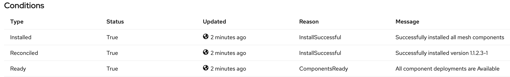

Before anything let’s log in our OpenShift cluster.

[source,bash,role=execute]
----
oc login --insecure-skip-tls-verify -u %username% -p %ocp_password% --server=https://%KUBERNETES_SERVICE_HOST%:%KUBERNETES_SERVICE_PORT%
----

Did you type the command in yourself? If you did, click on the command
instead and you will find that it is executed for you. You can click on
any command which has the [.fas .fa-play-circle]## icon shown to the
right of it, and it will be copied to the interactive terminal and run.
If you would rather make a copy of the command so you can paste it to
another window, hold down the shift key when you click on the command.

Now let’s create a project to deploy our knative services (ksvc).

[source,bash,role="execute"]
----
oc new-project %username%-tutorial
oc new-project %username%-smcp
----

*Installing the OpenShift Service Mesh Control Plane*

NOTE: Although you don’t have to do it yourself, it’s important to
note that the OpenShift Service Mesh Operator needs to be
https://docs.openshift.com/container-platform/%OC_VERSION%/service_mesh/service_mesh_install/installing-ossm.html#ossm-control-plane-deploy-operatorhub_installing-ossm[installed]
cluster-wide (on all namespaces on the cluster), this is the default by
the way.

*Prerequisites:*

* Access to the OpenShift Container Platform web console.
* The Elasticsearch Operator must be installed.
* The Jaeger Operator must be installed.
* The Kiali Operator must be installed.

So, let’s intall the OpenShift Service Mesh Control Plane. You can find
all the details
https://docs.openshift.com/container-platform/%OC_VERSION%/service_mesh/service_mesh_install/installing-ossm.html#ossm-control-plane-deploy-operatorhub_installing-ossm[here],
but for the sake of simplicity just follow these simple steps.

. Navigate to *Operators* → *Installed Operators*. If necessary, select
*%username%-smcp* from the *Project* menu. You may have to wait a few
moments for the Operators to be copied to the new project.
. Click the *Red Hat OpenShift Service Mesh Operator*. Under *Provided
APIs*, the Operator provides links to create two resource types:
*ServiceMeshControlPlane* and *ServiceMeshMemberRoll*.
. Under *Istio Service Mesh Control Plane* click *Create
ServiceMeshControlPlane*. On the Create Service Mesh Control Plane page,
eave the defaults.
. Click *Create* to create the control plane. The Operator creates Pods,
services, and Service Mesh control plane components based on your
configuration parameters.
. Click the *Istio Service Mesh Control Plane* tab.
. Click the *name* of the new control plane.
. Click the *Resources* tab to see the Red Hat OpenShift Service Mesh
control plane resources the Operator created and configured. Wait until
all the components are installed correctly, as in the next picture.

WARNING: By running the next command you should get `InstallSuccessful`

....
NAME            READY   STATUS              TEMPLATE   VERSION   AGE
basic-install   9/9     InstallSuccessful   default    v1.1      17h
....

[source,bash,role="execute"]
----
oc get smcp -n %username%-smcp
----

TIP: By running the next command you’ll watch the progress of the
Pods during the installation process.

....
NAME                                     READY   STATUS             RESTARTS   AGE
grafana-7bf5764d9d-2b2f6                 2/2     Running            0          28h
istio-citadel-576b9c5bbd-z84z4           1/1     Running            0          28h
istio-egressgateway-5476bc4656-r4zdv     1/1     Running            0          28h
istio-galley-7d57b47bb7-lqdxv            1/1     Running            0          28h
istio-ingressgateway-dbb8f7f46-ct6n5     1/1     Running            0          28h
istio-pilot-546bf69578-ccg5x             2/2     Running            0          28h
istio-policy-77fd498655-7pvjw            2/2     Running            0          28h
istio-sidecar-injector-df45bd899-ctxdt   1/1     Running            0          28h
istio-telemetry-66f697d6d5-cj28l         2/2     Running            0          28h
jaeger-896945cbc-7lqrr                   2/2     Running            0          11h
kiali-78d9c5b87c-snjzh                   0/1     Running            0          22h
prometheus-6dff867c97-gr2n5              2/2     Running            0          28h
....

[source,bash,role="execute"]
----
oc get pods -n %username%-smcp
----

*Creating the Red Hat OpenShift Service Mesh member roll*

The *ServiceMeshMemberRoll* lists the projects belonging to the control
plane. _Only projects listed in the *ServiceMeshMemberRoll* are affected
by the control plane_. A project does not belong to a service mesh until
you add it to the member roll for a particular control plane deployment.

_You must create a *ServiceMeshMemberRoll* resource *named default* in
the *same project as the ServiceMeshControlPlane*_

. Navigate to *Operators* → *Installed Operators*.
. Click the *Project* menu and choose the project where your
*ServiceMeshControlPlane* is deployed from the list, it should be
*%username%-smcp*.
. Click the *Red Hat OpenShift Service Mesh Operator*.
. Click the *All Instances* tab.
. Click *Create New*, and then select *Istio Service Mesh Member Roll*.
. On the *Create Service Mesh Member Roll* page, modify the YAML to add
your projects as members. You can add any number of projects, but a
project can only belong to one ServiceMeshMemberRoll resource. Add
*%username%-tutorial*
. Click Create to save the Service Mesh Member Roll.

[source,yaml]
----
apiVersion: maistra.io/v1
kind: ServiceMeshMemberRoll
metadata:
  name: default
  namespace: %username%-smcp
spec:
  members:
    - %username%-tutorial
----

*Installing the sample application we’re going to use in this tutorial*

[source,bash,role="execute"]
----
oc create -n %username%-tutorial -f /opt/app-root/workshop/content/k8s/curl.yaml 
oc create -n %username%-tutorial -f /opt/app-root/workshop/content/k8s/customer.yaml
oc create -n %username%-tutorial -f /opt/app-root/workshop/content/k8s/gateway.yaml
oc create -n %username%-tutorial -f /opt/app-root/workshop/content/k8s/preference.yaml
oc create -n %username%-tutorial -f /opt/app-root/workshop/content/k8s/recommendation.yaml
----

Let's decorate the application to make it more readable from the topology view.

[source,bash,role="execute"]
----
oc project %username%-tutorial && \
oc label deployment/curl app.openshift.io/runtime=load-balancer --overwrite=true && \
oc label deployment/customer-v1 app.openshift.io/runtime=quarkus --overwrite && \
oc label deployment/preference-v1 app.openshift.io/runtime=quarkus --overwrite && \
oc label deployment/recommendation-v1 app.openshift.io/runtime=quarkus --overwrite && \
oc label deployment/recommendation-v2 app.openshift.io/runtime=quarkus --overwrite && \
oc label deployment/recommendation-v3 app.openshift.io/runtime=quarkus --overwrite && \
oc label deployment customer-v1 app.kubernetes.io/part-of=customers --overwrite && \
oc label deployment preference-v1 app.kubernetes.io/part-of=customers --overwrite && \
oc label deployment recommendation-v1 app.kubernetes.io/part-of=customers --overwrite && \
oc label deployment recommendation-v2 app.kubernetes.io/part-of=customers --overwrite && \
oc label deployment recommendation-v3 app.kubernetes.io/part-of=customers --overwrite && \
oc annotate deployment preference-v1 app.openshift.io/connects-to=recommendation-v1,recommendation-v2,recommendation-v3 && \
oc annotate deployment customer-v1 app.openshift.io/connects-to=preference-v1
----

*_If you need to set the default project run this_*

If you have already created the project you can always set it as default
running this command:

[source,bash,role="execute"]
----
oc project %username%-tutorial
----
